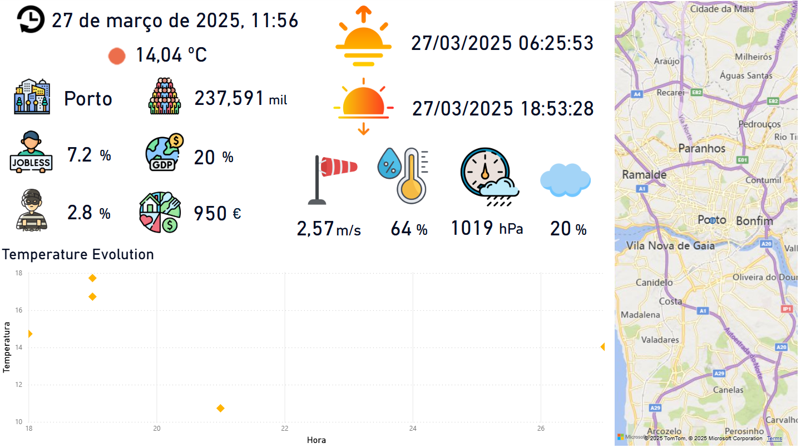

# Azure-Based Weather Data Processing Project

## Overview
This project utilizes Microsoft Azure to retrieve and process weather data from the OpenWeatherMap API. The system is designed to ingest, store, process, and analyze weather data efficiently using a producer/subscriber strategy. The architecture involves multiple Azure services such as **Event Hubs**, **Blob Storage**, and **Azure SQL**, along with **PySpark** for data processing and **Power BI** for data visualization and manipulationss.

## System Pipeline

This environment was built around the creation of a common **Resourse Group** in Azure, where all the compoments coexist in the same enviroment.
This allowed a better organization and simplification of the setup process.
This pipeline was built around the creation of a **Data LakeHouse** that combines both raw and structured data. 
We also followed some of the **Medallion Architecture** patterns (by using BRONZE, SILVER and GOLD terms) to indicate stages and improvements on the overall **Data Quality**(See Above).

## Required Environment Variables
This project requires several environment variables from both Azure and OpenWeatherMap API, which are not shared in this repository for security reasons:

- **API Key** (OpenWeatherMap API): Required to authenticate and fetch weather data.
- **Event Hubs Configuration**: Includes connection string, namespace, and topic details required for streaming data.
- **Blob Storage Configuration**: Contains account key, container name, and access policies to store raw JSON data and Parquet files.
- **Azure SQL Configuration**: Consists of connection string, database name, username, and password to store processed data securely.

Ensure these variables are securely stored in **Azure Key Vault** or in an **environment variables** before running the project.

## Data Flow and Processing
### **1. Data Ingestion (Notebook #1 & #2)**
- **Notebook #1 (Data Producer) - BRONZE**:
  - Fetches real-time weather data from OpenWeatherMap API.
  - Formats and structures the retrieved data.
  - Sends raw data (JSON format) to an Azure Event Hubs topic (`weather-data`) , creating a Kafka-based queue system.

- **Notebook #2 (Data Subscriber) - SILVER**: 
  - Listens to the Event Hubs stream for new incoming weather data.
  - Retrieves the raw JSON data from the Event Hubs topic.
  - Stores the data in Azure Blob Storage:
    - **Raw JSON storage:** Saves incoming data in a blob container (`weather-data`).
    - **Parquet file storage:** Aggregates raw data into a structured Parquet file (`weather-data.parquet`) for efficient storage and querying.

### **2. Data Processing and Storage (Notebook #3) - GOLD** 
- **Data Retrieval:** The raw Parquet file is retrieved from Azure Blob Storage.
- **Schema Definition:** A structured schema is defined to ensure consistency and validity of the data.
- **Transformation and Cleaning:**
  - Missing values are handled appropriately.
  - Data types are converted to match database requirements.
  - Unnecessary columns are filtered out.
- **Azure SQL Insertion:** The cleaned and structured data is stored in Azure SQL using PySpark DataFrame methods, ensuring optimized query performance and secure storage.

### **3. Data Analysis and Visualization**
- **Power BI Integration:**
  - The Power BI dashboard is connected directly to Azure SQL Database to visualize weather trends and insights.
  - Live data updates ensure up-to-date reporting.
- **Additional Excel Files:**
  - Datasets containing stats about some of the main cities in Portugal and a detailed description about the weather status, given a certain id. 
  - Used to explore **DAX** and **Power Query** functionalities for additional data transformation.
  - Helps enrich the dashboard by integrating and manipulating external datasets and models.
- **Key Metrics Visualized:**
  - Latest registered weather update.
  - Temperature trends over time.
  - Humidity and pressure variations.
  - Geographic weather patterns.
  - City social stats overview.

## Dashboard Image

## Future Improvements
- Implement **synchronization** between Notebook #1 and Notebook #2 to improve efficiency and avoid data loss.
- Enhance **real-time analytics** by integrating Azure Stream Analytics for faster processing.
- Automate **data ingestion and transformation** using Azure Data Factory pipelines or through **Databricks Jobs**.
- Improve **Power BI dashboard interactivity** with drill-through reports and dynamic filtering, and by adding more cities.

## Conclusion
This project demonstrates a scalable and cloud-based approach to weather data processing using Azure services. By leveraging Azure Event Hubs, Blob Storage, Azure SQL, and Power BI, it ensures efficient data ingestion, processing, and visualization while maintaining security and flexibility. This architecture provides a foundation for future enhancements, where new features and improvements to the overall system can be implemented.